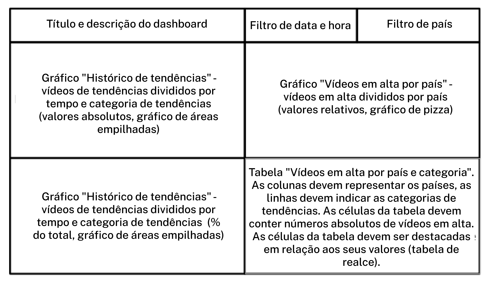
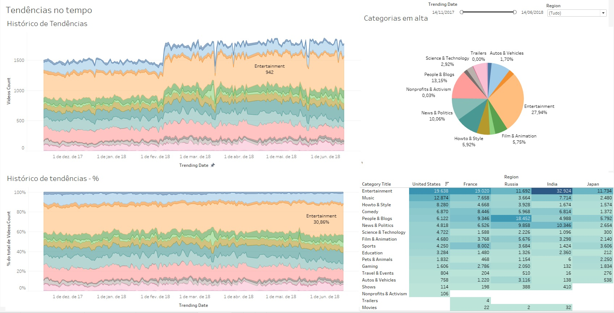
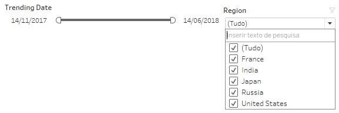
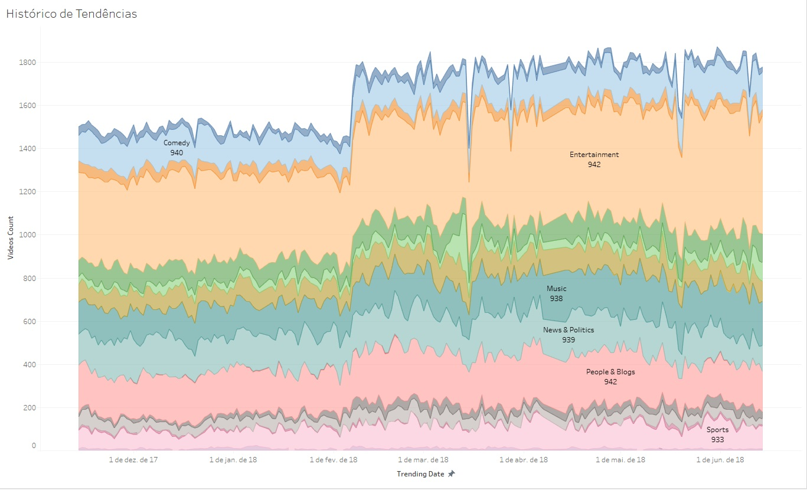
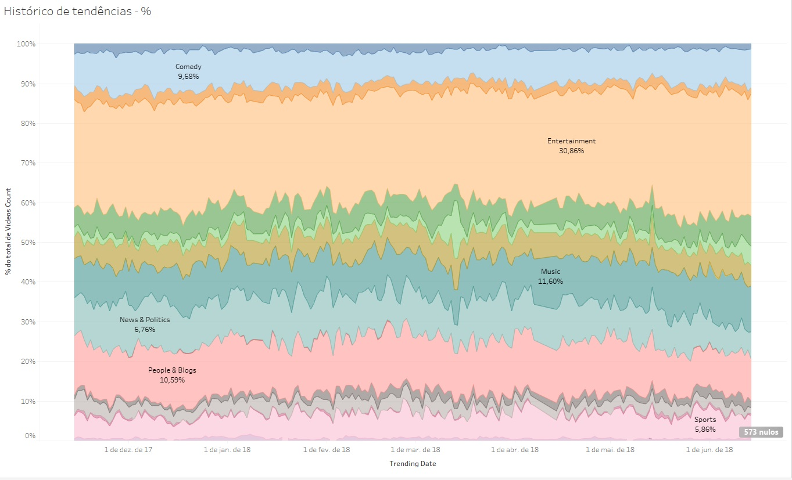
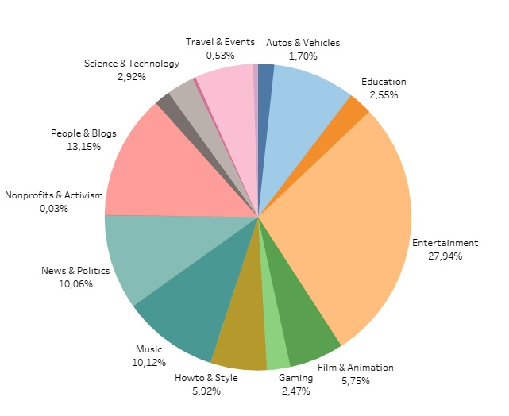
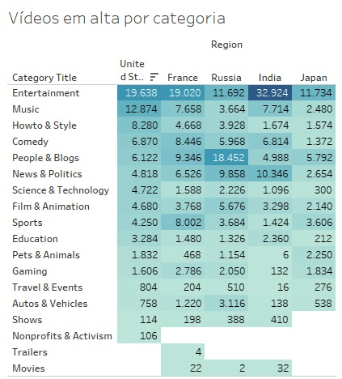

# Relatório Dashboard

---

## Introdução

Com a finalidade de suprir a demanda de informações recorrentes foi criado esse Dashboard com o intuito de automatizar o processo de análise.

O Dashboard apresentado foi estruturado da seguinte maneira:

## Dashboard

A forma final do Dashboard será apresentada dessa forma:

 

### Filtros de Categoria e Tempo

Em primeiro lugar, no cano superior direito acima do gráfico pizza, encontram-se os filtros que podem ser acionados para selecionar a região e o intervalo de tempo desejado.

 

### Históricos de tendências

Ao canto superior esquerdo podemos ver o gráfico de tenências que contabiliza os videos em tendência nas datas filtradas, dividido por tempo e categoria.

 

 

Já no canto inferior esquerdo temos o gráfico do Histórico de Tendências porém apresentando a porcentagem que cada categoria representa do total de vídeos tendência.

 

 

### Gráfico Pizza

No canto superior direito temos um Gráfico de Pizza que mostra a as categorias em alta por país e intervalo de tempo.

 

 

### Tabela de Vídeos em alta por país e categoria

E por último no canto inferior direito temos essa tabela que apresenta em suas colunas os países, que podem ser usadas como filtros, apenas clicando no nomes ou ordenando por valores crescentes, decrescentes, em ordem alfabética e etc.

# Link para o Dashboard

[Dashboard - Têndencias no tempo](https://public.tableau.com/app/profile/raphael.ramier/viz/Projeto_11_Final/Dashboard?publish=yes)